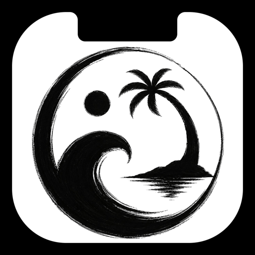

<p align="center">
  
</p>

<h1 align="center">ZenIsland</h1>

<p align="center">
  Transform your Mac's notch into a live, interactive island.<br />
  Now Playing · Battery · Weather · Calendar · Notifications · Extensions
</p>

## Requirements

- macOS 14 Sonoma or later
- Xcode 15+
- [XcodeGen](https://github.com/yonaskolb/XcodeGen) — `brew install xcodegen`
- Node.js 18+ (only needed to work on extensions)

---

## Setup

```bash
git clone <your-zenisland-repo-url>
cd zenisland
xcodegen generate
open ZenIsland.xcodeproj
```

Select the `ZenIsland` scheme, choose your Mac as the destination, and hit Run.

> On first launch the app will ask for Accessibility, Calendar, and Location permissions. These are required for the relevant modules to work.

## Local Build

For a local Debug build:

```bash
DEVELOPER_DIR=/Applications/Xcode.app/Contents/Developer xcodebuild -project ZenIsland.xcodeproj -scheme ZenIsland -configuration Debug -destination 'platform=macOS' build
```

---

## Project structure

```
ZenIsland/
  App/              AppDelegate, AppState
  Modules/          Built-in modules (Battery, NowPlaying, Weather, …)
  Settings/         Settings window views
  Utilities/        UpdateChecker, AutoUpdater, helpers
  Views/            CompactView, ExpandedView, IslandWindow
ExtensionHost/      JS runtime, extension manager, bridge
Extensions/         Bundled extensions (pomodoro, whatsapp-web, …)
scripts/            Local extension maintenance scripts
```

---

## Extensions

Extensions are JavaScript packages that run inside a sandboxed JavaScriptCore context. Read the local guide in [EXTENSIONS.md](EXTENSIONS.md).

## Notifications

The Notifications module supports source-level controls for ZenIsland extensions, the bundled WhatsApp integration, and compatible public app broadcasts. See [docs/NOTIFICATIONS.md](docs/NOTIFICATIONS.md).
## Now Playing

Now Playing supports system media, Apple Music, Spotify, and opt-in browser media detection for supported Chromium browsers. See [docs/NOW_PLAYING.md](docs/NOW_PLAYING.md).

## Energy settings

Settings -> General -> Power includes Normal, Smart, and Low Power modes. Smart reduces background refresh while the island is collapsed, while Low Power slows non-essential work and pauses inactive extension timers. See [docs/ENERGY.md](docs/ENERGY.md) for profiling notes and scheduler behavior.

## Appearance

Home slots, compact island size, animation intensity, and reduced motion can be configured in Settings. See [docs/APPEARANCE.md](docs/APPEARANCE.md).

## Calendar

The Calendar module supports account/source selection, holiday and birthday filters, duplicate collapse, and meeting-link actions. See [docs/CALENDAR.md](docs/CALENDAR.md).

## File Shelf

The built-in Shelf module can stage local files, folders, URLs, text snippets, and images from the island. See [docs/SHELF.md](docs/SHELF.md).

---

## Contributing

See [CONTRIBUTING.md](CONTRIBUTING.md).
